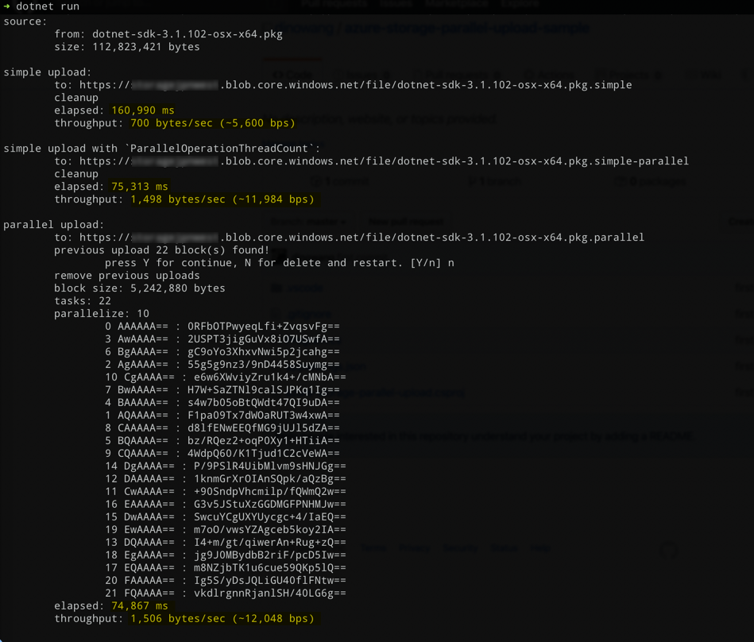

# Upload file to Azure Blob Storage in faster way samples

Steps:
1. Clone this project.
2. Modify appsettings.json set StorageConnectionString for your own storage account.
3. Execute `dotnet run` in console.

## Console `dotnet run`



# 2020-11-02 for sharing

## Azure Blob Storage SDK

### Standard

- DownloadBlockList
- PutBlock
- PutBlockList

### Async

- DownloadBlockListAsync
- PutBlockAsync
- PutBlockListAsync

## Concept

```
Block Id = Convert.ToBase64String(BitConverter.GetBytes(chunkIndex))
```

## Articles

- [Quickstart: Azure Blob storage client library v12 for .NET](https://docs.microsoft.com/en-us/azure/storage/blobs/storage-quickstart-blobs-dotnet)

- [Uploading blobs to Microsoft Azure - The robust way](https://blog.geuer-pollmann.de/blog/2014/07/21/uploading-blobs-to-azure-the-robust-way/)
- [Uploading Large Files to Azure Blob Storage in C#](https://www.andrewhoefling.com/Blog/Post/uploading-large-files-to-azure-blob-storage-in-c-sharp)